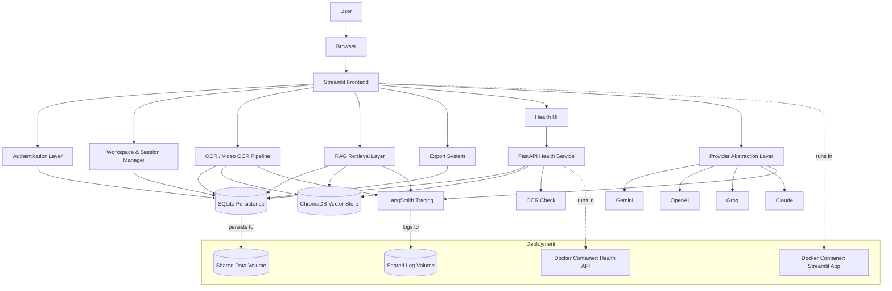
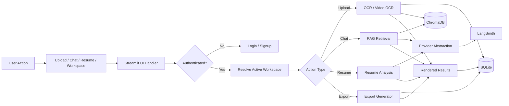
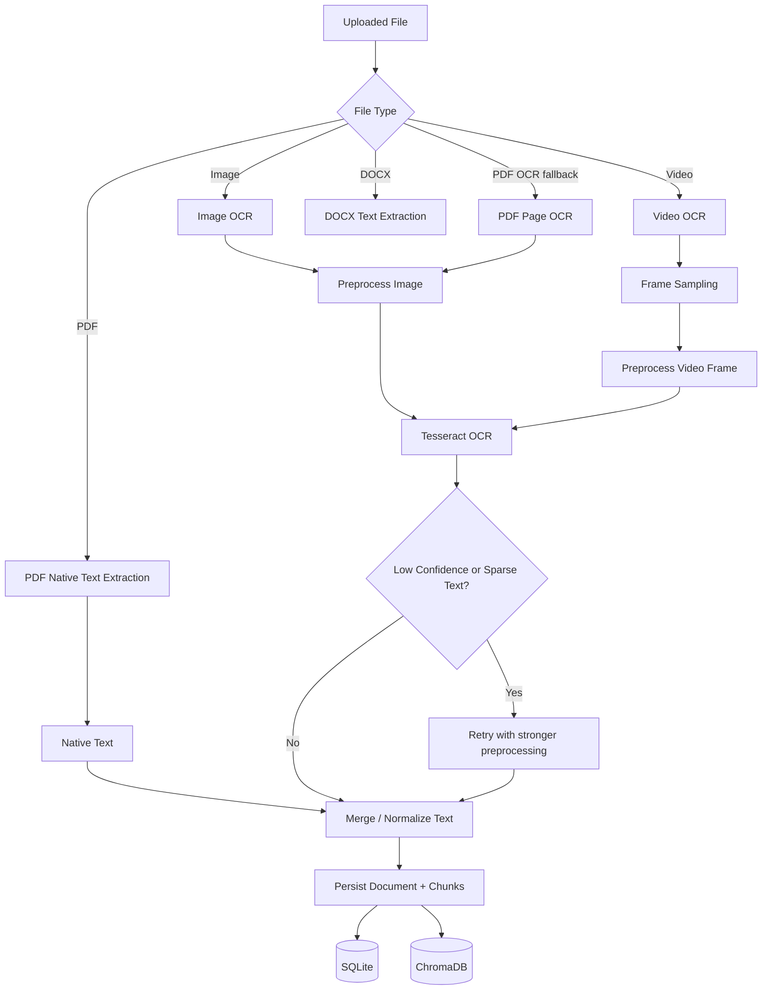
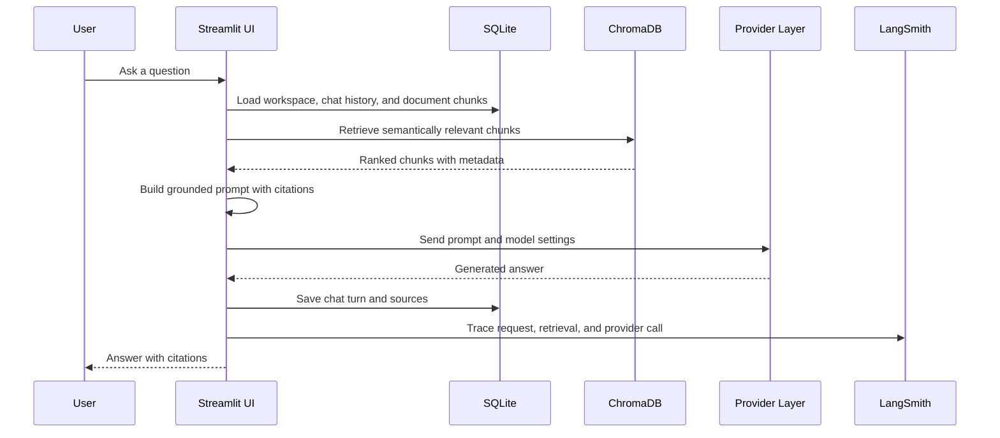
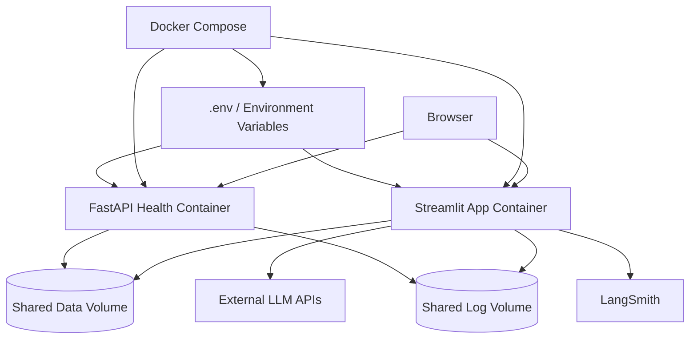

# Architecture

This document describes the production architecture of the Multimodal AI SaaS platform, including the request path, OCR/video OCR processing, provider abstraction, RAG retrieval, persistence, deployment, observability, and operational safeguards.

## System Architecture

## Component Flow

## OCR Pipeline

## RAG Workflow

## Deployment Architecture

## Request Flow

1. The user opens the Streamlit interface and authenticates.
2. The app resolves the active workspace and loads stored documents, chat history, and analytics.
3. Uploads go through file classification, OCR or native extraction, persistence, and chunking.
4. Chat questions trigger retrieval against the vector store and the persisted chunk metadata.
5. The prompt builder combines the latest sources with recent conversation memory.
6. The provider abstraction layer sends the request to the selected model.
7. The response is rendered in the UI, traced in LangSmith, and persisted to SQLite.
8. Export actions generate TXT, PDF, or DOCX artifacts from the saved content.

## Deployment Explanation

The platform runs as two containers in Docker Compose:

1. The Streamlit container hosts the product UI, OCR pipeline, RAG orchestration, and persistence writes.
2. The FastAPI container exposes a lightweight `/health` endpoint for probes and operational checks.
3. Both services share the same data and log volumes so database files, exported artifacts, and rotating logs remain durable across restarts.
4. Configuration comes from `.env` and runtime environment variables, which keeps secrets out of the repository and supports promotion between environments.

The Docker image bundles the runtime Python dependencies and the system packages required by Tesseract and PDF conversion. This keeps the deployment self-contained and avoids relying on host-installed OCR tooling.

## Security Notes

1. Authentication is required before workspace access, document persistence, or chat history retrieval.
2. Passwords are hashed, and session tokens are stored server-side rather than embedded in the UI.
3. Uploaded filenames are sanitized before they are stored or displayed.
4. Rate limiting is applied to high-cost actions such as uploads, summaries, chat generation, and resume analysis.
5. Secrets are loaded from environment variables and masked in logs through the centralized logging filter.
6. The health endpoint exposes only operational status and no user content.
7. The production container uses a minimal Python base image and avoids shipping unnecessary build artifacts.

## Observability

The observability model has three layers:

1. Rotating file logs capture requests, OCR operations, provider calls, and errors in separate log channels.
2. LangSmith traces the OCR, retrieval, and model-generation path for debugging, latency analysis, and prompt inspection.
3. The FastAPI health service reports database, OCR, and vector-store readiness for uptime monitoring and deployment validation.

Together, these layers cover runtime diagnostics, cost-sensitive AI operations, and environment health.

## Caching Strategy

1. The embedding model and Chroma client are cached at process scope to avoid repeated initialization overhead.
2. OCR preprocessing is applied only when a file or frame is actually processed, and extracted results are persisted so the same content does not need to be re-OCR'd on every query.
3. Session state keeps the active workspace, chat context, and UI controls in memory for fast interaction during a browser session.
4. Retrieval is limited to the top-ranked chunks so prompt size stays bounded and model calls remain efficient.

## Persistence Strategy

1. SQLite stores users, auth sessions, workspaces, documents, document chunks, chat history, and analytics events.
2. ChromaDB stores semantic vectors for document chunks so retrieval stays fast and local.
3. Shared Docker volumes preserve the database and logs across container restarts.
4. The app writes derived outputs such as exports and OCR results only after successful processing, which keeps persisted state consistent with the visible UI.
5. The database layer uses WAL mode, a busy timeout, and retryable writes to reduce lock contention during multi-action use.

## Summary

The platform is designed as a production SaaS document assistant with a clear separation between the UI, the AI services, persistence, and operations. Streamlit handles the user experience, SQLite and ChromaDB provide local durable storage, LangSmith provides traceability, and Docker Compose packages the app with a health surface suitable for deployment.