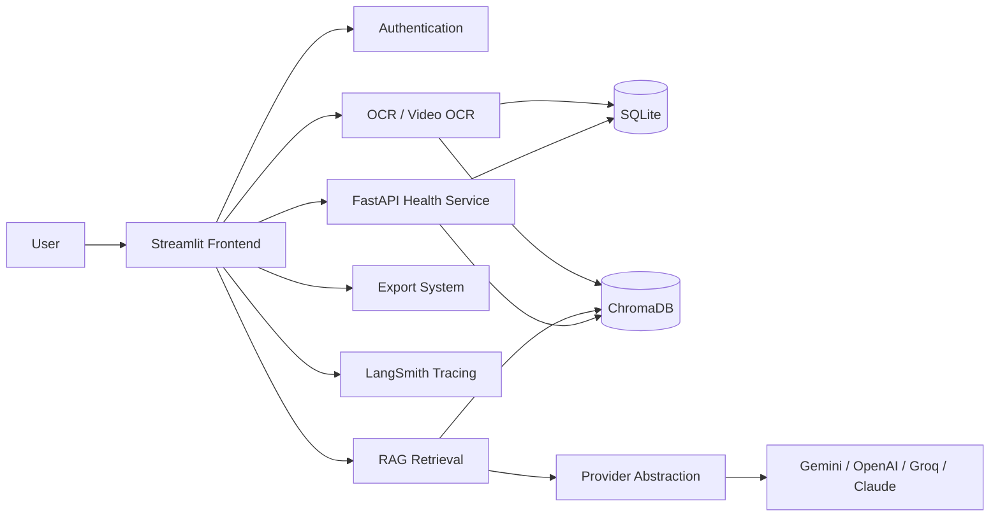

# Eshwar — Multimodal Document Analyzer

<<<<<<< HEAD


Production-grade multimodal AI SaaS for OCR, video text extraction, source-aware RAG, document intelligence, and workspace-based collaboration.

[](https://www.python.org/)
[](https://streamlit.io/)
[](https://www.docker.com/)
[](LICENSE)
[](https://smith.langchain.com/)

## Hero

This platform turns unstructured documents, images, PDFs, and videos into searchable, cited, production-ready answers. It combines Streamlit, OCR, retrieval, persistence, tracing, and containerized deployment into one portfolio-ready SaaS experience.

## Why This Project Matters

- It reflects real enterprise AI workflows where documents arrive in many formats and need structured intelligence.
- It demonstrates multimodal ingestion across images, PDFs, DOCX files, and video frames.
- It uses a production RAG architecture with source-aware responses instead of generic chat output.
- It includes observability with rotating logs, request categories, and LangSmith traces.
- It shows how to package AI into a deployable product rather than a notebook prototype.

## Architecture Preview



For full diagrams and deployment topology, see [ARCHITECTURE.md](ARCHITECTURE.md).

## Feature Highlights

- Multimodal upload handling for images, PDFs, DOCX, and video files
- OCR preprocessing tuned for better extraction quality and fallback behavior
- Source-aware RAG responses with citations and conversation memory
- Persistent workspaces with saved chats, documents, chunks, and analytics
- Provider abstraction for Gemini, OpenAI, Groq, and Claude
- Resume analysis with job-description matching and ATS-style guidance
- Export generation in TXT, PDF, and DOCX formats
- Production health checks, rotating logs, and tracing support

## Screenshots

Add these public-release assets when you are ready:

| Placeholder | Recommended use |
|---|---|
| `docs/images/hero-banner.png` | Top-of-README banner |
| `docs/images/dashboard-overview.png` | Main product overview |
| `docs/images/ocr-upload-flow.png` | OCR and upload experience |
| `docs/images/rag-chat.png` | Source-aware Q&A flow |
| `docs/images/analytics.png` | Operational and usage analytics |

See [ASSETS.md](ASSETS.md) for banner and demo guidance.

## Demo

Suggested public demo assets:

| Asset | Purpose |
|---|---|
| `docs/demo/workflow-demo.gif` | Upload → OCR → retrieval → answer |
| `docs/demo/rag-answer-demo.gif` | Grounded answer with citations |
| `docs/demo/deployment-demo.gif` | Start-up and health check flow |

If you do not have media yet, keep this section in place and add the GIFs later. It signals portfolio readiness and helps recruiters understand the product quickly.

## Tech Stack

| Layer | Technologies |
|---|---|
| Frontend | Streamlit |
| OCR | pytesseract, Pillow, pdfplumber, pdf2image, OpenCV |
| LLM Providers | Gemini, OpenAI, Groq, Claude |
| Retrieval | ChromaDB, sentence-transformers |
| Persistence | SQLite |
| Observability | LangSmith, rotating logs |
| Deployment | Docker, Docker Compose, FastAPI health service |
| Utilities | python-dotenv, tenacity, reportlab, python-docx |

## Production Features

- Environment-based configuration with safe local defaults
- Secret masking in logs
- Rate limiting for expensive user actions
- Durable workspace persistence for auth and chat history
- Health endpoint for deployment probes and monitoring
- Dockerized runtime for repeatable builds and local parity
- Sanitized upload handling and production-focused file management

## Observability

The app includes three observability layers:

- Rotating logs for requests, OCR actions, provider calls, and errors
- LangSmith traces for prompt, retrieval, and model-call visibility
- A FastAPI health service for database, OCR, and vector-store checks

## Security

- API keys are stored in environment variables, not hardcoded
- Uploaded filenames are sanitized before reuse
- Authentication gates access to workspaces and stored content
- The health endpoint exposes only operational status
- The repository ignores `.env`, local databases, caches, and log files

## Roadmap

- Add richer screenshot and demo media for the public portfolio release
- Introduce stronger analytics and usage insights
- Expand deployment guides for additional cloud targets
- Add test coverage for public release workflows
- Extend persistence abstractions for future database portability

## Folder Structure

See [FOLDER_STRUCTURE.md](FOLDER_STRUCTURE.md) for a documented repository layout and module responsibilities.

## Deployment Instructions

### Docker Local Deployment

```bash
cp .env.example .env
docker compose up --build
```

The app runs on `http://localhost:8501` and the health service runs on `http://localhost:8502/health`.

### Streamlit Cloud

1. Push the repository to GitHub.
2. Set the app entry point to `app/main.py`.
3. Add environment variables in the Streamlit Cloud settings page.
4. Confirm that the Tesseract binary is available in the target environment or adapt OCR settings accordingly.

### Render

1. Create a new Web Service from the GitHub repository.
2. Use `streamlit run app/main.py --server.address=0.0.0.0 --server.port=$PORT` as the start command.
3. Configure the environment variables from `.env.example`.
4. If deploying the health service separately, run `uvicorn app.health_api:app --host 0.0.0.0 --port 8502` as a second service.

## Quick Start

```bash
pip install -r requirements.txt
streamlit run app/main.py
```

The system requires Tesseract OCR on the host or container image.

## API Keys

=======
Production-grade OCR + LLM pipeline built with Streamlit.

---

## Features

| Feature | Details |
|---|---|
| OCR extraction | PNG, JPG, JPEG, PDF (native + OCR fallback), DOCX |
| OCR preprocessing | Greyscale → sharpen → contrast boost |
| Summary modes | Concise, Detailed, Bullet Points, Executive, Technical |
| Tone control | Neutral, Formal, Casual, Academic |
| Provider support | Gemini, OpenAI, Groq, Claude |
| Groq models | llama-3.3-70b-versatile, llama-3.1-8b-instant, mixtral-8x7b-32768 |
| RAG Q&A | ChromaDB + sentence-transformers (all-MiniLM-L6-v2) |
| Resume analysis | Skills, strengths, ATS score, job-description matching |
| Downloads | TXT, PDF (ReportLab), DOCX (python-docx) |
| Retry logic | tenacity — 3 attempts, exponential back-off |
| Groq fallback | Auto-tries next allowed model on failure |

---

## Quick Start

### 1. Install dependencies

```bash
pip install -r requirements.txt
```

> **System requirement:** Tesseract OCR must be installed.
>
> - **Ubuntu/Debian:** `sudo apt install tesseract-ocr poppler-utils`
> - **macOS:** `brew install tesseract poppler`
> - **Windows:** Install from https://github.com/UB-Mannheim/tesseract/wiki

### 2. Run the app

```bash
streamlit run app/main.py
```

Open http://localhost:8501

### 3. Docker

```bash
docker build -t eshwar .
docker run -p 8501:8501 eshwar
```

---

## API Keys

Enter your key in the sidebar. Keys are **never** hardcoded or logged.

>>>>>>> eb3e5fd1243b399c1b484e8468c3e4b3de7c7525
| Provider | Environment variable |
|---|---|
| Gemini | `GOOGLE_API_KEY` |
| OpenAI | `OPENAI_API_KEY` |
| Groq | `GROQ_API_KEY` |
| Claude | `ANTHROPIC_API_KEY` |

<<<<<<< HEAD
## License

This project is released under the MIT License. See [LICENSE](LICENSE).
=======
You can also pass keys via environment variables so the sidebar auto-fills:

```bash
export GROQ_API_KEY=gsk_...
streamlit run app/main.py
```

---

## Changelog (stabilization pass)

### Fixed
- **Groq deprecated models removed** — replaced with `llama-3.3-70b-versatile`, `llama-3.1-8b-instant`, `mixtral-8x7b-32768`
- **Groq automatic fallback** — if primary model fails, tries next allowed model before raising
- **OpenAI SDK** — `from openai import OpenAI` throughout; no deprecated `openai.ChatCompletion`
- **Groq SDK** — uses OpenAI-compatible `base_url`; no `groq` SDK import needed
- **Gemini** — `google-generativeai` direct; removed all LangChain wrappers
- **Requirements** — removed LangChain, pydantic v1 pin, conflicting chromadb pins; upgraded to stable modern versions
- **OCR pipeline** — added `img.verify()` for early corrupt-image detection; temp files always cleaned via `finally`
- **OCR preprocessing** — greyscale + sharpen + contrast applied before Tesseract
- **RAG index** — ephemeral ChromaDB client; cosine similarity; safe retrieval (returns `[]` on error)
- **Session state** — all keys initialized in `_DEFAULTS`; provider switching resets model to valid default; no rerun loops
- **Download** — TXT/PDF/DOCX all produce valid, non-corrupt files; PDF uses ReportLab
- **Retry** — `tenacity` applied to all provider calls (3 attempts, exp back-off)
- **UI** — dark theme preserved; banner-ok/banner-err for feedback; chat bubbles styled

### Added
- `rag_utils.py` — dedicated RAG module (build_index, retrieve)
- `download_utils.py` — dedicated download module (to_txt, to_pdf, to_docx)
- Resume analyzer tab with job-description matching
- About tab with full feature/provider listing

### Not changed
- Dark UI theme
- Tab layout
- Core OCR logic
- Provider API call structure
>>>>>>> eb3e5fd1243b399c1b484e8468c3e4b3de7c7525
